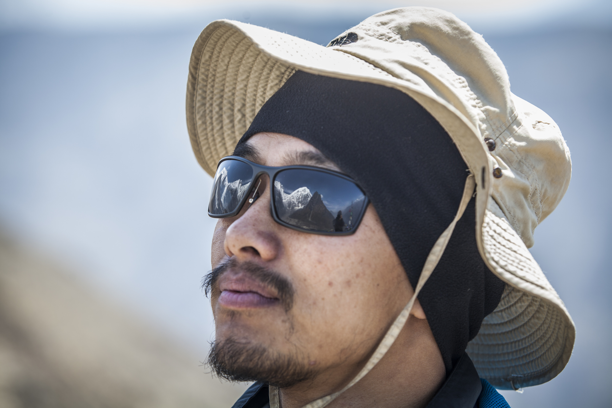

```{=html}
<!-- HERO -->
<div style="background: linear-gradient(135deg,#0d2b45,#1a4a6e); color:white; padding:1rem 2rem;">
  <div style="max-width:1100px; margin:0 auto;">
  
    <p style="color:#c8d8e8;">I'm always happy to discuss research collaborations, questions, or opportunities.</p>
  </div>
</div>

<!-- TWO COLUMN LAYOUT -->
<div style="max-width:1100px; margin:0 auto; display:grid; grid-template-columns:220px 1fr; gap:2rem; padding:2rem;">

  <!-- PROFILE SIDEBAR -->
  <div>
    <div class="profile-card">
      
      <div class="profile-name">Tika Ram Gurung</div>
      <div class="profile-role">Ph.D. Candidate<br/>University of Nebraska-Lincoln</div>
      <ul class="profile-links">
        <li>📍 Lincoln, NE</li>
        <li>✉️ <a href="mailto:tikargrg@gmail.com">tikargrg@gmail.com</a></li>
        <li>🔬 <a href="https://www.researchgate.net/profile/Tika-Ram-Gurung" target="_blank">ResearchGate</a></li>
        <li>🎓 <a href="https://scholar.google.com/citations?user=TMxdLn0AAAAJ&hl=en" target="_blank">Google Scholar</a></li>
        <li>💼 <a href="https://www.linkedin.com/in/tika-ram-gurung-55a743a3/" target="_blank">LinkedIn</a></li>
        <li>🔵 <a href="https://orcid.org/0000-0003-4287-6150" target="_blank">ORCID</a></li>
        <li>🐦 <a href="https://x.com/TR_Gurung" target="_blank">X / Twitter</a></li>
      </ul>
    </div>
  </div>

  <!-- MAIN CONTENT -->

 <!-- MAIN CONTENT -->
  <div>

    <!-- Blog Card 1 -->
    <div class="pub-item" style="margin-bottom:1.5rem;">
      <div class="pub-title">Into the Hidden Valley: On a Quest for High Mountain Data</div>
      <div class="pub-authors">ICIMOD Field Blog</div>
      <div class="pub-journal" style="margin-bottom:0.5rem;">A firsthand account of glacier monitoring expeditions in remote Himalayan valleys.</div>
      <a href="https://www.icimod.org/into-the-hidden-valley-on-a-quest-for-high-mountain-data/" target="_blank" style="color:#2e86ab; font-size:0.85rem; font-weight:600;">Read on ICIMOD →</a>
    </div>

    <!-- Blog Card 2 -->
    <div class="pub-item" style="margin-bottom:1.5rem;">
      <div class="pub-title">Ensuring Long-Term Data Series on Trambau and Trakarding Glaciers, Rolwaling Valley</div>
      <div class="pub-authors">ICIMOD Field Blog</div>
      <div class="pub-journal" style="margin-bottom:0.5rem;">Documenting efforts to maintain continuous glacier monitoring records in the Rolwaling Valley, Nepal.</div>
      <a href="https://www.icimod.org/article/ensuring-long-term-data-series-on-trambau-and-trakarding-glaciers-rolwaling-valley/" target="_blank" style="color:#2e86ab; font-size:0.85rem; font-weight:600;">Read on ICIMOD →</a>
    </div>

  </div>
</div>
  </div>
</section>

<footer class="site-footer">
  <p>© 2026 Tika Ram Gurung · University of Nebraska-Lincoln</p>
</footer>
` ``
```