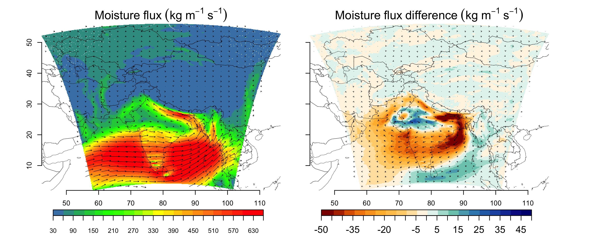
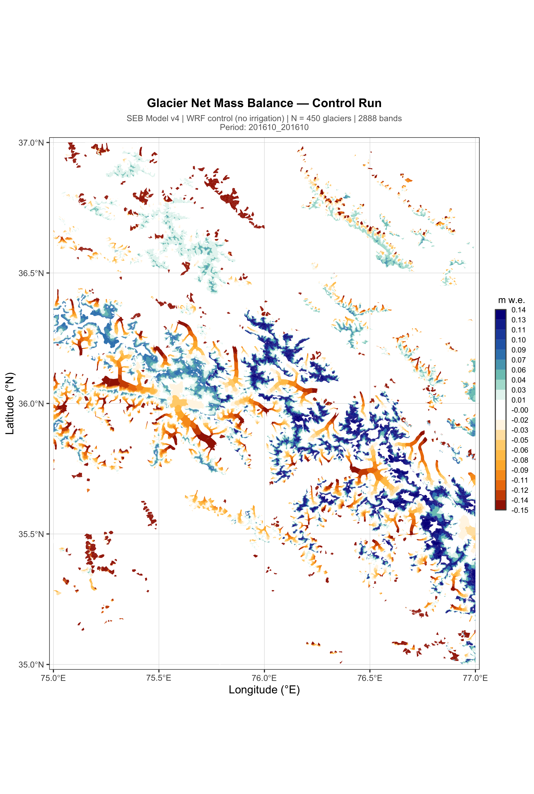

```{=html}
<!-- HERO -->
<!-- <section class="hero-section"> -->
<section class="hero-section" style="background-image: linear-gradient(135deg, rgba(13,43,69,0.7), rgba(26,74,110,0.6)), url('Tika.JPG'); background-size:cover; background-position:center;">

<div style="max-width:900px; margin:0 auto; position:relative; z-index:0; text-align:center; width:100%; padding:0 0rem;">

<h2 class="hero-name" style="color:white; font-size:2rem;
text-shadow: 2px 2px 8px rgba(0,0,0,0.8); border-bottom:none;">Tika Ram Gurung</h2>
    <p class="hero-title" style="color:white; font-size:1.2rem;
text-shadow: 1px 1px 8px rgba(0,0,0,0.8); border-bottom:none;">Ph.D. Candidate in Climatology &amp; Meteorology</p>
    <p class="hero-affil">Department of Earth and Atmospheric Sciences, University of Nebraska-Lincoln</p>

    <p class="hero-tagline" style="text-align:center;">"Climate and cryosphere scientist with expertise in glacier mass balance, permafrost, high mountain hydroclimate, and heatwaves, now integrating numerical modeling and in-situ field data to understand how soil moisture, irrigation, and moisture transport shape hydroclimate variability from Himalayan glaciers to regional scales."
</p>
    
    <div class="hero-badges">
      <span class="badge-pill">🏔️ Cryosphere</span>
      <span class="badge-pill">💧 Hydroclimate</span>
      <span class="badge-pill">🌏 High Mountain Asia</span>
      <span class="badge-pill">🌾 Irrigation &amp; Climate</span>
      <span class="badge-pill">🔥 Heatwaves</span>
      <span class="badge-pill">🏜️ Drought</span>
      <span class="badge-pill">🖥️ WRF Modeling</span>
      <span class="badge-pill">📊 R &amp; Python</span>
    </div>
    <div class="hero-links">
      <a href="research.html">View Research</a>
      <a href="publications.html" class="secondary">Publications</a>
      <a href="cv.html" class="secondary">CV</a>
      <a href="contact.html" class="secondary">✉ Contact</a>
    </div>
  </div>
</section>

<!-- STATS -->
<section class="section" style="background:white; padding:2.5rem 2rem;">
  <div style="max-width:900px; margin:0 auto;">
    <div style="display:grid; grid-template-columns:repeat(auto-fit,minmax(160px,1fr)); gap:1rem;">
      <div class="stat-box">
        <div class="stat-number">8+</div>
        <div class="stat-label">Publications</div>
      </div>
      <div class="stat-box">
        <div class="stat-number">20</div>
        <div class="stat-label">Glacier Expeditions</div>
      </div>
      <div class="stat-box">
        <div class="stat-number">6+</div>
        <div class="stat-label">Years Work Experiences</div>
      </div>
      <div class="stat-box">
        <div class="stat-number">2</div>
        <div class="stat-label">Major Awards (2024)</div>
      </div>
    </div>
  </div>
</section>

<!-- ABOUT -->
<section class="section section-alt">
  <div style="max-width:900px; margin:0 auto; display:grid; grid-template-columns:1fr 2fr; gap:3rem; align-items:start;">
    <div>
      <div class="section-title">About</div>
      <br/>
      <p style="font-size:0.92rem; color:#4a5568; line-height:1.7;">
        I am a climate scientist and Ph.D. candidate at the University of Nebraska-Lincoln, specializing in land/cryosphere-atmosphere processes and regional climate modeling. My research integrates numerical modeling and large datasets to understand how human factors such as irrigation interact with natural climate systems in South Aisa and High Mountain Asia.
      </p>
      <p style="font-size:0.92rem; color:#4a5568; line-height:1.7; margin-top:0.8rem;">
        Prior to my PhD, I spent several years as a Research Associate and Cryosphere Analyst at ICIMOD, leading glacier monitoring expeditions across high altitude glaciers in the Central Himalaya.
      </p>
    </div>
    <div>
      <div class="section-title">Ongoing Research</div>
      <br/>
  <div style="display:grid; grid-template-columns:1fr; gap:1.2rem;">
        <div class="project-card">
          
          <div class="project-card-body">
            <span class="tag">Hydroclimate</span><span class="tag">WRF</span>
            <h3>Irrigation &amp; South Asian Hydroclimate</h3>
            <p>Quantifying how large-scale irrigation in the Indo-Gangetic Plain alters moisture flux and precipitation patterns across South Asia.</p>
          </div>
        </div>
        <div class="project-card">
          
          <div class="project-card-body">
            <span class="tag">Glacier mass balance</span><span class="tag">Cryosphere</span>
            <h3>Irrigation &amp; Glacier Dynamics</h3>
            <p>Investigating the cascading effects of irrigation-driven climate modification on glacier mass balance in High Mountain Asia.</p>
          </div>
        </div>
      </div>
    </div>
  </div>
</section>

<!-- RECENT PUBS TEASER -->
<section class="section" style="background:white;">
  <div style="max-width:900px; margin:0 auto;">
    <div class="section-title">Recent Publications</div>
    <br/>
    <div class="pub-item">
      <div class="pub-title">Evaluating the performance of high-resolution climate simulations over the Central Himalaya and Karakoram</div>
      <div class="pub-authors"><strong>Gurung, T.R.</strong>, Chen, L., Ali, S.H., Rowe, C., Arriola, F.M. and Ritzema, R.S.</div>
      <div class="pub-journal">Climate Dynamics, 64(3), p.120 · 2026</div>
      <a href="https://doi.org/10.1007/s00382-025-08030-x" target="_blank">DOI →</a>
    </div>
    <div class="pub-item">
      <div class="pub-title">Modelling seasonal fluctuations and aspect characteristics of ice-cliff melt on the debris-covered Trakarding Glacier</div>
      <div class="pub-authors">Sato, Y., Buri, P., ... <strong>Gurung, T.R.</strong>, et al.</div>
      <div class="pub-journal">Journal of Glaciology, 71, p.e33 · 2025</div>
      <a href="https://doi.org/10.1017/jog.2025.17" target="_blank">DOI →</a>
    </div>
    <div class="pub-item">
      <div class="pub-title">Understanding the influence of soil moisture on heatwave characteristics in the contiguous United States</div>
      <div class="pub-authors"><strong>Gurung, T.R.</strong> and Chen, L.</div>
      <div class="pub-journal">Environmental Research Letters, 19(6) · 2024</div>
      <a href="https://doi.org/10.1088/1748-9326/ad4dbb" target="_blank">DOI →</a>
    </div>
    <p style="margin-top:1rem;"><a href="publications.html" style="color:#2e86ab; font-weight:600;">See all publications →</a></p>
  </div>
</section>

<!-- FOOTER -->
<footer class="site-footer">
  <p>© 2026 Tika Ram Gurung · University of Nebraska-Lincoln</p>
  <p style="margin-top:0.3rem;">
    <a href="mailto:tgurung3@nebraska.edu">tgurung3@nebraska.edu</a> ·
    <a href="https://doi.org/10.1007/s00382-025-08030-x">Latest Paper</a>
  </p>
</footer>
```
